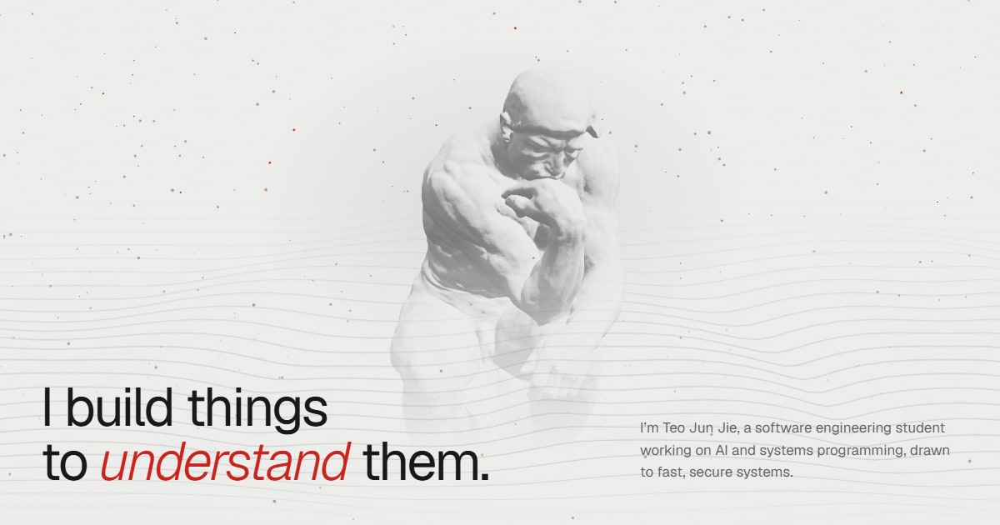

This essay is a test page. It stays a draft, so it shows in `npm run dev` and never in the build. Everything below is written the way Obsidian writes it.

## Text

Plain paragraphs, **bold**, *italic*, ~~struck~~, `inline code` and [links](https://svelte.dev). A ==highlighted phrase== uses Obsidian's double equals.

- Lists keep their bullets
- [ ] Task lists work
- [x] And can be ticked

> An ordinary quote stays a quote.

## Math

Inline math sits in the sentence: the loss is $L(\theta) = \frac{1}{n}\sum_{i=1}^{n} \ell(f_\theta(x_i), y_i)$.

Display math gets its own line:

$$
\theta_{t+1} = \theta_t - \eta \, \nabla_\theta L(\theta_t)
$$

## Code

```ts title="gradient.ts"
export function step(theta: number[], grad: number[], lr = 0.01) {
	return theta.map((t, i) => t - lr * grad[i]); // [!code highlight]
}
```

```python {2}
def relu(x):
    return max(0.0, x)
```

```rust
fn main() {
    let v = vec![1, 2, 3]; // [!code --]
    let v: Vec<i32> = (1..=3).collect(); // [!code ++]
    println!("{v:?}");
}
```

## Callouts

> [!note]
> A note with the default title.

> [!warning] Not yet verified
> This result only held on one seed. Callout titles can be anything.

> [!quote] Hume
> Reason is, and ought only to be the slave of the passions.

## Images


